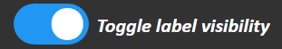

## `getImageData.js` [_(back to Contents)_](#Table-of-Contents)
> Contains the function that:
> - displays the uploaded image _(but not the detection boxes)_
> - converts the uploaded image to the correct format for sending to Google Cloud ML (TODO add monkey patching)

 

### getImageArray(pageDiv, toBase64, callback) <i>[in <a href='#getimagedatajs-back-to-contents'><code>getImageData.js</code></a>]</i> [_(back to Contents)_](#Table-of-Contents)
<blockquote>
  <ul>
    <li>draws the uploaded image onto the <a href='#glossary-page'><b>*</b></a>page's canvas</li>
    <li>
      and get the image data in either 3D RGB tensor/array or base64 encoded format
      

        
Example of 3D RGB tensor/array

        <blockquote>
          a 3D RGB tensor/array of a 2x2 square 
          <i>(color: R=1, G=2, B=3)</i> 
          <pre>[
  [[1, 2, 3], [1, 2, 3]],
  [[1, 2, 3], [1, 2, 3]]
]</pre>
        </blockquote>
      

  </li>
  </ul>
</blockquote>

Parameter|Type|Description
---|---|---
pageDiv|`HTMLDivElement`|`
` HTML element of the page
toBase64|`bool`|whether or not the model accepts base64 encoded images, defined in `acceptsBase64` (type:`bool`) in `modelInfo` _(in `CONFIG_modelInfo.js`)_
callback|`function`|the callback function to return the formatted image data; expects 2 params, `callback(errorMsg, imageData)`, where `errorMsg` (type:`str`) is the error message, and is `null` when there's no error

**What this function does:**

- read the uploaded image file

- monkey patch `displayScaledImage` _(with the same `displaySize` parameter)_ to the canvas element object as the function `redrawImage`
  - for redrawing of image by [`toggleBoxVisibility`](#toggleboxvisibilitychkbox-in-guifunctionsjs-back-to-contents)

- draw the image

- scale down the image if it's estimated to be too big

- format the image into either 3D RGB array or base64 string

- return the formatted image data

 

### Inner functions in `getImageArray`

### onBoxSwitch() <i>[Inner function of <a href='#getimagearraypagediv-tobase64-callback-in-getimagedatajs-back-to-contents'><code>getImageArray</code></a>]</i> [_(back to Contents)_](#Table-of-Contents)
> Toggle on the "`Toggle box visibility`" switch 

Image of the switch
<blockquote></blockquote>

This is to ensure the detection boxes are always shown whenever a new image is uploaded.

  
Reason for doing so

  <blockquote>
    Else the user might toggle-off the boxes, send a new image and wonder why there are no boxes <i>(when in reality, it's because the boxes' visibilities are toggled off)</i>
  </blockquote>

 

### displayScaledImage(displaySize) <i>[Inner function of <a href='#getimagearraypagediv-tobase64-callback-in-getimagedatajs-back-to-contents'><code>getImageArray</code></a>]</i> [_(back to Contents)_](#Table-of-Contents)
> Displays the uploaded image file, by scaling it to `displaySize` and then drawing it on the <a href='#glossary-page'><b>*</b></a>page's canvas.

The displayed image will have an area equal to (displaySize ^ 2).

	
Reason for (<code>displaySize</code> ^ 2)

	I thought it would be easier for one to estimate length rather than area. <i>(ie. easier to estimate width and height of image rather than area)</i>
	 So <code>displaySize=512</code> will scale the images to the same area as a 512x512 image.

 

### getRGBArray() <i>[Inner function of <a href='#getimagearraypagediv-tobase64-callback-in-getimagedatajs-back-to-contents'><code>getImageArray</code></a>]</i> [_(back to Contents)_](#Table-of-Contents)
<blockquote>
  Gets the image data in 3D RGB array format.
  

    
Example of 3D RGB tensor/array

    <blockquote>
      a 3D RGB tensor/array of a 2x2 square 
      <i>(color: R=1, G=2, B=3)</i> 
      <pre>[
  [[1, 2, 3], [1, 2, 3]],
  [[1, 2, 3], [1, 2, 3]]
]</pre>
    </blockquote>
  

</blockquote>

**What this function does:**

<ul>
  <li>creates a new invisible canvas</li>
  <li>
    estimate if image will exceed Google Cloud's payload limit of 1572864 bytes
    

      
Details on how the `98303` value was calculated

      The largest string a pixel can be in 3D RGB array format can be is "[[xxx,xxx,xxx]]," where the RGB values are all 3-digit integers, and where the image is a 1 pixel thick vertical line.
      Thus, the max. byte size of a pixel is 16 <i>(ie. the byte size of "[[xxx,xxx,xxx]],")</i>
      Hence, assuming max. bytes per pixel, the max. number of pixels an image can have before exceeding the 1572864 bytes limit is: <code>(1572864 - 2) / 16 = 98303.875</code> , where - 2 is for the other most square brackets.
    

  </li>
  <ul>
    <li>if it's estimated to be too big, the image is scaled down</li>
  </ul>
  <li>
    using the new canvas, get the raw 1D RGBA <i>(A for alpha)</i> image data
    

      
Format of 1D RGBA image data

      <blockquote>
        <pre>[R1, G1, B1, A1, R2, G2, B2, A2, R3, ...]</pre>
        where <code>R1, G1, B1, A1</code> are the RGBA values of the 1st pixel; <code>R2, G2, B2, A2</code> are that of the 2nd pixel
      </blockquote>
    

  </li>
  <li>
    parse/format the image data to 3D RGB array
    

      
Example of 3D RGB tensor/array

      <blockquote>
        a 3D RGB tensor/array of a 2x2 square 
        <i>(color: R=1, G=2, B=3)</i> 
        <pre>[
  [[1, 2, 3], [1, 2, 3]],
  [[1, 2, 3], [1, 2, 3]]
]</pre>
      </blockquote>
    

  </li>
  <li>return the formatted image data to callback function</li>
</ul>

 

### getBase64() <i>[Inner function of <a href='#getimagearraypagediv-tobase64-callback-in-getimagedatajs-back-to-contents'><code>getImageArray</code></a>]</i> [_(back to Contents)_](#Table-of-Contents)
> Gets the image data in base64 encoding.

**What this function does:**

- creates a new invisible canvas
- estimate if image will exceed Google Cloud's payload limit of 1572864 bytes
- if it's estimated to be too big, the image is scaled down
- using the new canvas, get base64 image data
- check if the base64 data is still too big
  - if its still too big, keep scaling it down until it's below the 1572864 bytes limit
- return the formatted image data to callback function

 

### Inner functions in `getBase64`
### getScaledB64(_scale)
> Scales the image down by `_scale` (type:`float`), then get the base64 image data of the scaled image.

`_scale` is how much the image **area** will be scaled down by. _(ie. `_scale = 0.5` will half the image **area**)

The scaling and getting of the base64 data is down using the invisible canvas created in `getBase64`.

 

### getEstimatedScale(imageArea)
> Estimate if image will exceed Google Cloud's payload limit of 1572864 bytes, and return the required scale-down value if it's too big.

`1.54` is just a ballpark estimate of base64 byte-size per pixel.

 

### Misc. functions in `getImageData.js`

### getByteSize(str) <i>[in <a href='#getimagedatajs-back-to-contents'><code>getImageData.js</code></a>]</i> [_(back to Contents)_](#Table-of-Contents)
> Same as the [getByteSize](TODO) in `googleApiFunctions.js`.

 

 
