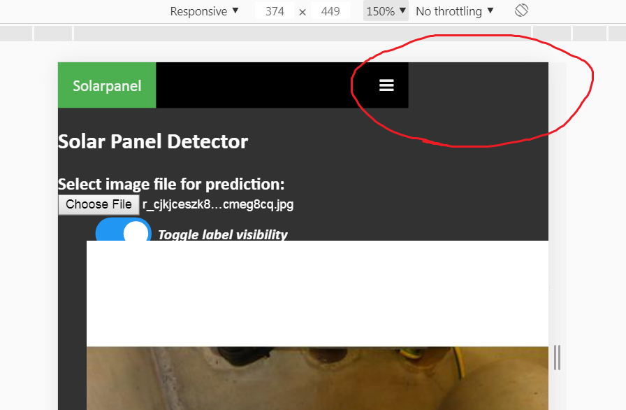
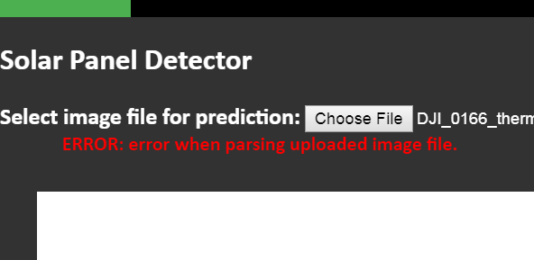

## `guiFunctions.js` <sup><sup>[_(back to Contents)_](#Table-of-Contents)</sup></sup>
> Contains all gui-related functions, including:
> - switching<a href='#glossary-tab'><b> **</b></a>tabs /<a href='#glossary-page'><b> *</b></a>pages
> - displaying loading animations
> - the functions trigger right after the user uploads an image, such as
>   - validating if the uploaded file is of the correct type
>   - calling the functions in the other modules to perform the prediction request
> - displaying error messages on the<a href='#glossary-page'><b> *</b></a>page
> - etc.

<br>

### focusOn(tabElement) <sub><i>[in <a href='#guifunctionsjs-back-to-contents'><code>guiFunctions.js</code></a>]</i></sub> <sup><sup>[_(back to Contents)_](#Table-of-Contents)</sup></sup>
> Triggers when user clicks on another<a href='#glossary-tab'><b> **</b></a>tab, which makes the clicked tab "active", and displays the respective<a href='#glossary-page'><b> *</b></a>page elements.

tabElement is the HTML element object of the selected<a href='#glossary-tab'><b> **</b></a>tab.

**What this function does:**

- remove the `active` class from all<a href='#glossary-tab'><b> **</b></a>tabs elements _(making them all black)_
- add active class to selected<a href='#glossary-tab'><b> **</b></a>tab element _(making it green)_
- hide all <a href='#glossary-page'><b> *</b></a>pages
- show only the respective selected page<details><summary>Details</summary><blockquote>If tab id is "tab-2", the function will find for the page with id "page-2"</blockquote></details>

<br>

### openNavBar() <sub><i>[in <a href='#guifunctionsjs-back-to-contents'><code>guiFunctions.js</code></a>]</i></sub> <sup><sup>[_(back to Contents)_](#Table-of-Contents)</sup></sup>
> Triggers when the window's width becomes narrow _(eg. when viewing on phone)_, which makes the navigation bar responsive.

The responsive navigation bar design is taken from: https://www.w3schools.com/howto/howto_js_topnav_responsive.asp

However, the navigation bar isn't properly responsive as the canvas is bigger than the responsive navigation bar. 

<details>
  <summary>Image</summary>
  <blockquote>
    
  </blockquote>
</details>

<br>

### window.setInterval( () => { ... <sub><i>[in <a href='#guifunctionsjs-back-to-contents'><code>guiFunctions.js</code></a>]</i></sub> <sup><sup>[_(back to Contents)_](#Table-of-Contents)</sup></sup>
> A script that animates the "`Loading...`" dots.

Uses `pagesThatsLoading` (type:`dict` of `HTMLDivElement`) to determine the pages that needs to be animated. If a <a href='#glossary-page'><b>*</b></a>page's div element object is in `pagesThatsLoading`, this script will animate the dots.

<br>

### displayLoading(pageDiv) <sub><i>[in <a href='#guifunctionsjs-back-to-contents'><code>guiFunctions.js</code></a>]</i></sub> <sup><sup>[_(back to Contents)_](#Table-of-Contents)</sup></sup>
> Starts and displays the loading animations, and hide the "`Toggle box visibility`" switch on the `pageDiv` (type:`HTMLDivElement`) <a href='#glossary-page'><b>*</b></a>page.

It starts the "`Loading...`" dot animation by adding `pageDiv` (type:`HTMLDivElement`) to `pagesThatsLoading` (type:`dict` of `HTMLDivElement`) to be animated by the [window.setInterval](TODOwindow.setInterval) script.

<br>

### stopLoading(pageDiv) <sub><i>[in <a href='#guifunctionsjs-back-to-contents'><code>guiFunctions.js</code></a>]</i></sub> <sup><sup>[_(back to Contents)_](#Table-of-Contents)</sup></sup>
> Stops and hides the loading animations on the `pageDiv` (type:`HTMLDivElement`) <a href='#glossary-page'><b>*</b></a>page.

It stops the "`Loading...`" dot animation by removing `pageDiv` (type:`HTMLDivElement`) from `pagesThatsLoading` (type:`dict` of `HTMLDivElement`), thus stopping the [window.setInterval](TODOwindow.setInterval) script from animating it.

Unlike [`displayLoading`](TODO), this function doesn't show the "`Toggle box visibility`" switch. 

<details>
  <summary>Reason</summary>
  <blockquote>
    When an error occurs, the loading animations needs to be hidden, and replaced by the error message instead of the switch. 
    <br><br>
    So the hide-loading function and show-switch function needs to be seperated.
  </blockquote>
</details>

<br>

### displayToggleSwitch(pageDiv) <sub><i>[in <a href='#guifunctionsjs-back-to-contents'><code>guiFunctions.js</code></a>]</i></sub> <sup><sup>[_(back to Contents)_](#Table-of-Contents)</sup></sup>
> Shows the "`Toggle box visibility`" switch on the `pageDiv` (type:`HTMLDivElement`) <a href='#glossary-page'><b>*</b></a>page.

<br>

### displayError(pageDiv, strError) <sub><i>[in <a href='#guifunctionsjs-back-to-contents'><code>guiFunctions.js</code></a>]</i></sub> <sup><sup>[_(back to Contents)_](#Table-of-Contents)</sup></sup>
> Displays the `strError` (type:`str`) error message on the `pageDiv` (type:`HTMLDivElement`) <a href='#glossary-page'><b>*</b></a>page.

<details>
  <summary>Image of error message</summary>
  <blockquote>
    
  </blockquote>
</details>

<br>

### hideError(pageDiv) <sub><i>[in <a href='#guifunctionsjs-back-to-contents'><code>guiFunctions.js</code></a>]</i></sub> <sup><sup>[_(back to Contents)_](#Table-of-Contents)</sup></sup>
> Hides error message on the `pageDiv` (type:`HTMLDivElement`) <a href='#glossary-page'><b>*</b></a>page.

<details>
  <summary>Image of error message</summary>
  <blockquote>
    
  </blockquote>
</details>

<br>

### toggleBoxVisibility(chkbox) <sub><i>[in <a href='#guifunctionsjs-back-to-contents'><code>guiFunctions.js</code></a>]</i></sub> <sup><sup>[_(back to Contents)_](#Table-of-Contents)</sup></sup>
> Toggle visibility of detection boxes on the image, based on whether `chkbox` (type:`HTMLInputElement` with `type="checkbox"`) is checked or not.

It hides boxes by redrawing the image on the canvas, on top of the old boxed image, and shows by redrawing the boxes.

It does this by calling the either the [`redrawBoxes`](TODO) or [`redrawImage`](TODO) functions that's been monkey patched onto the canvas.

<br>

### isValidInput(inputElement) <sub><i>[in <a href='#guifunctionsjs-back-to-contents'><code>guiFunctions.js</code></a>]</i></sub> <sup><sup>[_(back to Contents)_](#Table-of-Contents)</sup></sup>
> Checks if the user-uploaded file/image has an extension thats found in [`acceptedFileExts`](TODO) _(in `CONFIG_misc.js`)_.

<br>

### buildClassnameTree(element) <sub><i>[in <a href='#guifunctionsjs-back-to-contents'><code>guiFunctions.js</code></a>]</i></sub> <sup><sup>[_(back to Contents)_](#Table-of-Contents)</sup></sup>
> Monkey patch HTML element objects to their parent elements by class names, for easy referencing.

**Example:**
<br>Consider this `div` container

```
<div id='myContainer'>
  <div class='class1'>
    <input class='class2' />
    <p>[TEXT]</p>
  <div>
</div>
```

<br>

By passing the `HTMLDivElement` object _(with `id="myContainer"`)_ through this function as `myElement`:

```
var myElement = document.getElementById('myContainer')
buildClassnameTree(myElement)
```

<br>

It will add `myElement`'s children to the `myElement` object
and the children can be referenced by their class names _(escaped with an underscore (`_`) prefix)_ _(same for the children's children etc.)_:

```
<div id='myContainer'>              // myElement
    <div class='class1'>            // myElement._class1
        <input class='class2' />    // myElement._class1._class2
        <p>[TEXT]</p>               // (No class, so not added to myElement._class1)
    <div>
</div>
```

<br>


Here's a snippet of the `div` element (`class="boxToggle"`) being referenced from the page's `div` element:
```
function displayToggleSwitch(pageDiv) {
    pageDiv._boxToggle.style.display = 'block'
}
```

<br>

### run(inputElement, model) <sub><i>[in <a href='#guifunctionsjs-back-to-contents'><code>guiFunctions.js</code></a>]</i></sub> <sup><sup>[_(back to Contents)_](#Table-of-Contents)</sup></sup>
> The function that triggers after the user uploads an **valid** image _(validated by [`isValidInput`](TODO))_. It calls the functions in the other modules to perform the prediction request.

Parameter|Type|Description
---|---|---
inputElement|`HTMLInputElement`|the file-upload input element object
model|`dict`|a dict in `modelInfo` _(in `/configs/CONFIG_modelInfo.js`)_ that contains the info on the model for the <a href='#glossary-page'><b>*</b></a>page

<br>
<hr>
<br>
