# Frontend for Google ML prediction
> This project was developed for **Firma Technologies**

- It's a simple **static website**
- built with **pure JavaScript**
- that uses an unofficial/makeshift way of interacting with the Google Cloud ML API _(by mimicing XHR requests made by [this website](https://developers.google.com/apis-explorer/#search/machine/ml/v1/ml.projects.predict))_ <blockquote>**FYI:** This is because there's current no official JavaScript client-library for Google Cloud ML API _(or at least not a well documented one)_</blockquote>

**_What it does:_**
- send images to a Tensorflow AI model _(deployed on Google Cloud ML Engine)_ for object detection
- then display the boxes of the detected objects on the image

> **WARNING**
>  Currently, as this is for testing purposes, the Google Cloud credentials are openly exposed in `/configs/CONFIG_credentials.js`.
>  
>  This means that you **_should not_** deploy this website to the public — only to those you trust — as someone malicious might use those credentials to screw us over.

 

## Table of Contents
> - [Setting up](#Setting-up)
>   - [Step 1: Getting Google Cloud credentials](#Step-1-Getting-Google-Cloud-credentials-back-to-contents)
>   - [Step 2: Configuration](#Step-2-Configuration-back-to-contents)
>     - [For `CONFIG_credentials.js`](#For-CONFIG_credentialsjs-back-to-contents)
>     - [For `CONFIG_modelInfo.js`](#For-CONFIG_modelInfojs-back-to-contents)
>   - [Step 3: Hosting the website](#Step-3-Hosting-the-website-back-to-contents)
> - [Dependencies](#Dependencies-back-to-contents)
> - [Author](#Author-back-to-contents)

> [Go to **documentation**](FRONTEND_DOCUMENTATION.md)

 

# Setting up
## Step 1: Getting Google Cloud credentials [_(back to Contents)_](#Table-of-Contents)
Steps:
1. Log in to your Google/Gmail account

2. Go to https://console.cloud.google.com

3. On the top navigation bar, select the project that has the deployed models 

Image
<blockquote>
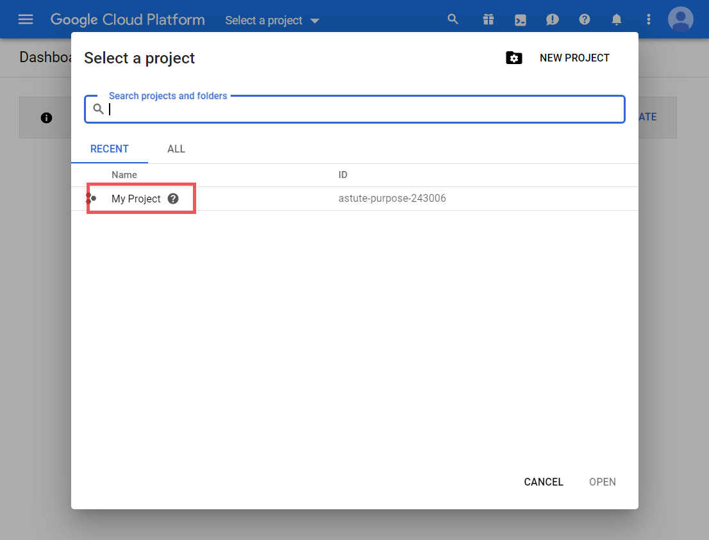</blockquote>

4. Open the top-left menu, and navigate to `IAM & admin` **>** `Roles` **>** `CREATE ROLE` 

Image
<blockquote>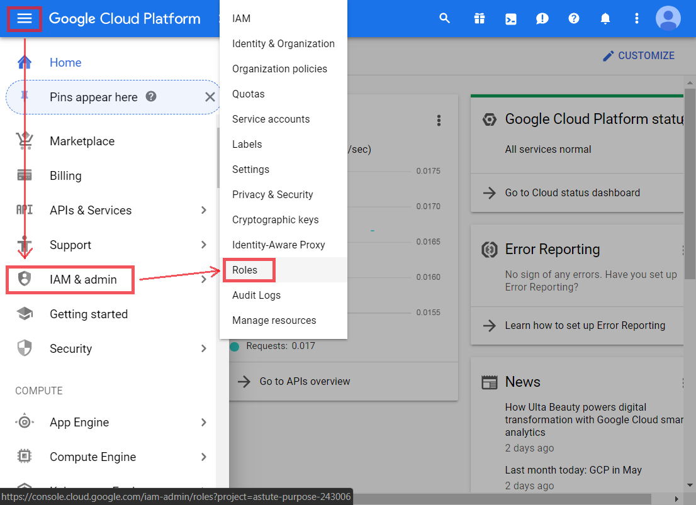
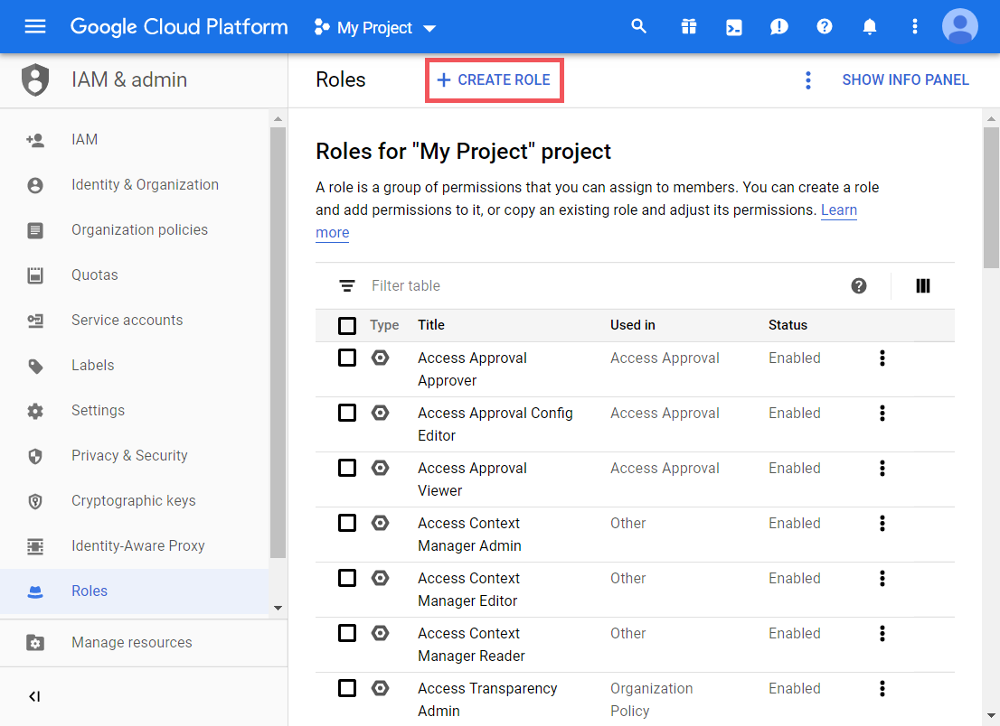</blockquote>

5. Click `ADD PERMISSIONS`, search for "model user", select `ML Engine Model User`, and add the permissions: `ml.models.predict` and `ml.versions.predict`  _(this will grant the credentials permissions to only request for predictions)_

Image
<blockquote>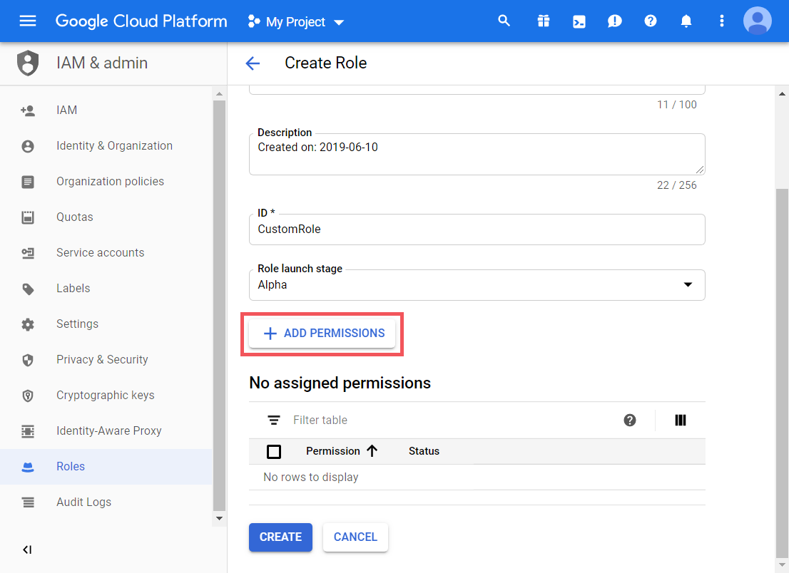
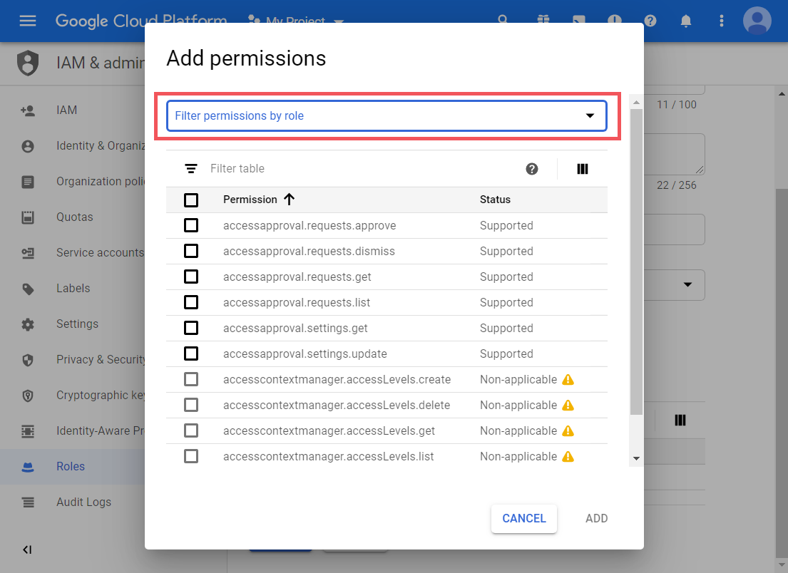
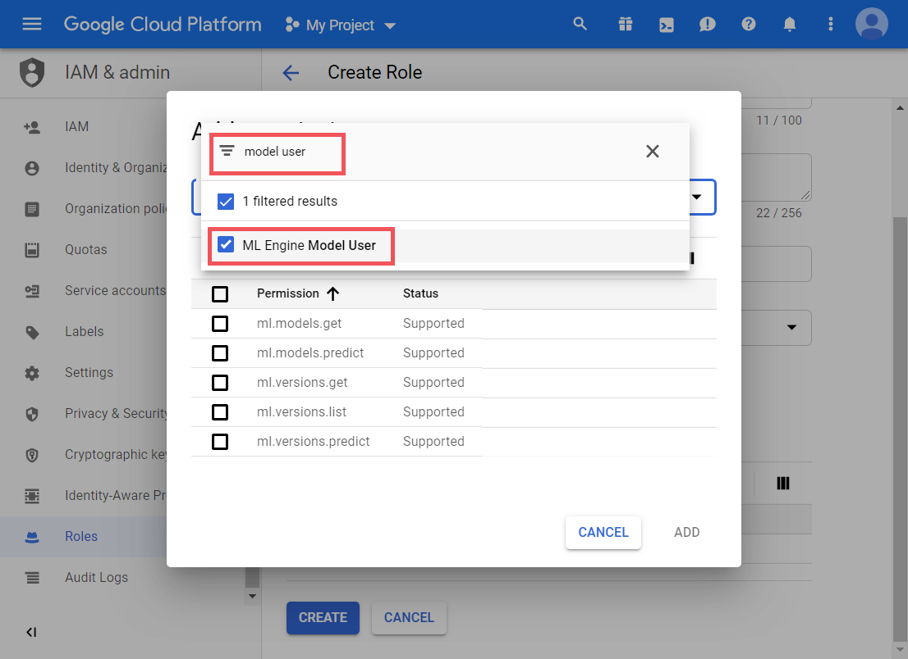
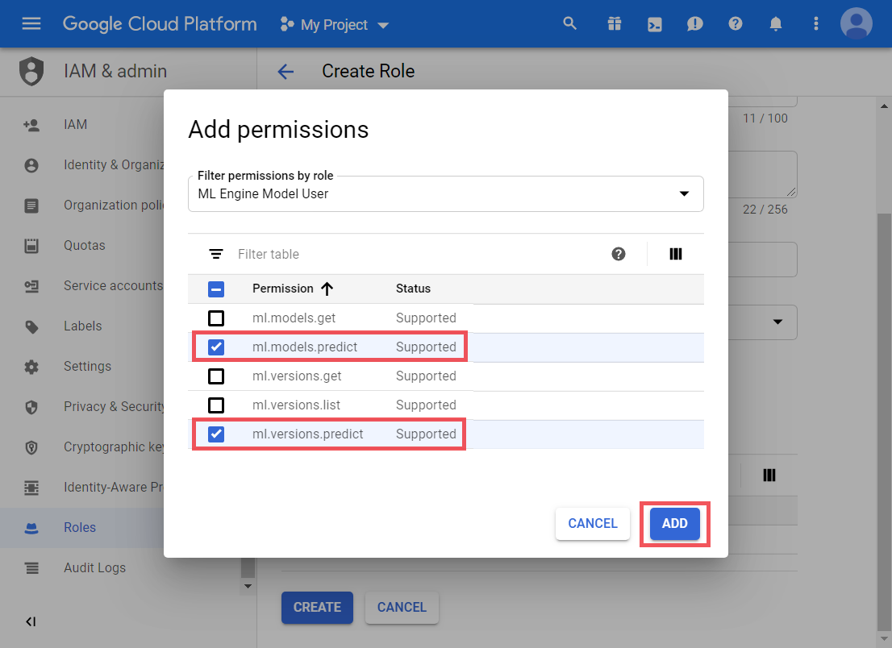</blockquote>

6. Fill in the other required details, then create the service account

7. Open the top-left menu, and navigate to `APIs & Services` **>** `Credentials` **>** `Create credentials` **>** `Service account key` 

Image
<blockquote>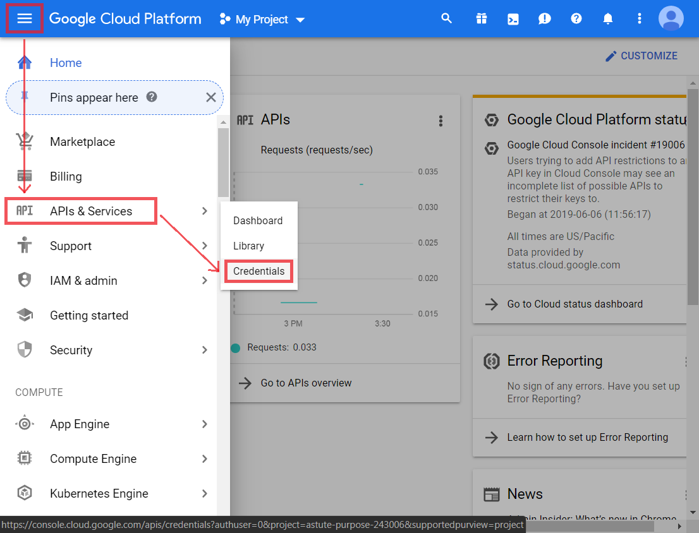
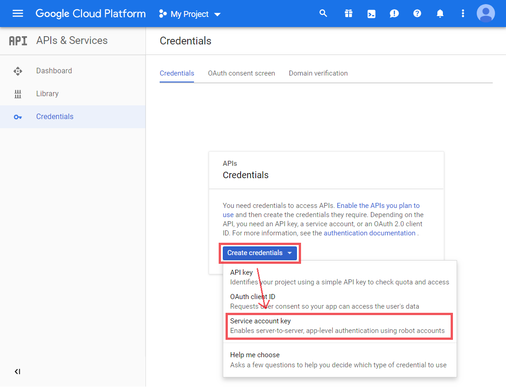</blockquote>
 

8. <ul><li>under <code>Service account</code>, select <code>New service account</code></li><li>select the custom role you just made</li><li>fill in the other required details</li><li>select JSON key type</li><li>then click <code>Create</code></li></ul> 

Images
<blockquote>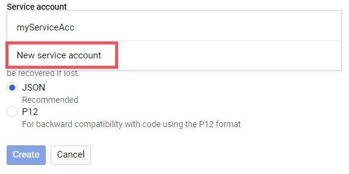
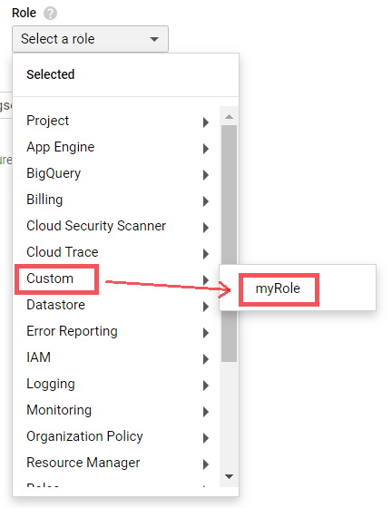
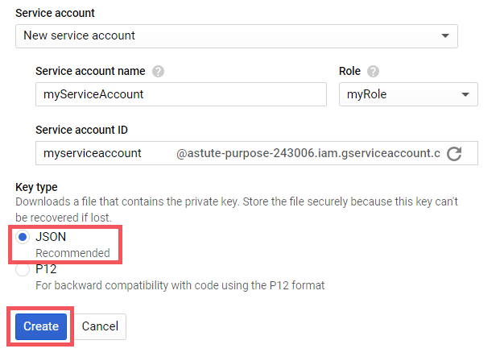</blockquote>

 

## Step 2: Configuration [_(back to Contents)_](#Table-of-Contents)

In the `configs` folder, edit the `CONFIG_credentials.js` and `CONFIG_modelInfo.js` files. 

 

### For `CONFIG_credentials.js` [_(back to Contents)_](#Table-of-Contents)

This contains the Google Cloud credentials used to get the predictions from Google Cloud ML.

`scope` _(probably)_ should always be the same, so leave it alone.
 Change `clientEmail`, `clientId`, `apiKey` and `privateKey` to that of your Google Cloud credential, and ensure that those credentials have access to request predictions from Google Cloud ML. _(more details in [documentation — CONFIG_credentials.js](FRONTEND_DOCUMENTATION.md#config_credentialsjs-back-to-contents))_

 

### For `CONFIG_modelInfo.js` [_(back to Contents)_](#Table-of-Contents)

This contains 
1. the details of the Google Cloud ML models
2. the desired display names/titles for the models on the HTML page

Insert all the required details as per [documentation — CONFIG_modelInfo.js](#config_modelinfojs-back-to-contents)

 

## Step 3: Hosting the website [_(back to Contents)_](#Table-of-Contents)

This repo/project is a static website, and thus can be easily hosted online without any server. _(such as on [Google Drive](https://www.process.st/how-to-host-a-website-on-google-drive-for-free/) or [AWS S3](https://medium.com/@kyle.galbraith/how-to-host-a-website-on-s3-without-getting-lost-in-the-sea-e2b82aa6cd38))_

It does, however, rely on a [_modified_ CORS-Anywhere proxy](https://github.com/EvitanRelta/cors-anywhere/tree/master) currently hosted at https://cors-header-writer.herokuapp.com _(and of course also relies on Google Cloud ML)_.

> **FYI:** If for some reason the default CORS-Anywhere proxy _(ie. https://cors-header-writer.herokuapp.com)_ is down, follow [this instruction](https://github.com/EvitanRelta/cors-anywhere/tree/master#Setting-up-proxy-on-Heroku-cloud-platform) to set up another one on Heroku; then change the `corsProxy` variable in `/configs/CONFIG_misc.js` to the new proxy's URL.

 

# Dependencies [_(back to Contents)_](#Table-of-Contents)

- [jsrsasign library](https://kjur.github.io/jsrsasign) - for JSON Web Signature (JWS) sigining, to get the Google Cloud access token using the credentials in `/configs/CONFIG_credentials.js` 
- [Font Awesome 4.7.0 (CSS file)](https://cdnjs.cloudflare.com/ajax/libs/font-awesome/4.7.0/css/font-awesome.min.css) - style for the top navigation bar; taken from [W3Schools — Responsive Top Navigation](https://www.w3schools.com/howto/howto_js_topnav_responsive.asp) <blockquote>**Note:** Font Awesome is "fully open source and is GPL friendly". [Here's its license.](https://fontawesome.com/v4.7.0/license/)</blockquote>
- [A modified CORS-Anywhere proxy](https://cors-header-writer.herokuapp.com) - to set fake restricted HTTP request headers _(eg. "User-Agent" and [other forbidden headers](https://fetch.spec.whatwg.org/#forbidden-header-name))_, to spoof Google Cloud ML into accept a prediction request from an unauthorised website _([the proxy's repo](https://github.com/EvitanRelta/cors-anywhere/tree/master))_ 
- _(And of course)_ a deployed Google Cloud ML AI model

 

# Author [_(back to Contents)_](#Table-of-Contents)

- Shaun Tan — _"Hi"_

 

> [Go to **documentation**](FRONTEND_DOCUMENTATION.md)